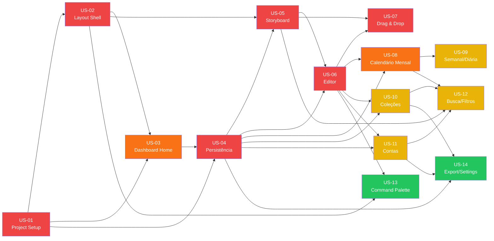

# Dashboard Instagram — User Stories Index (V1)

> Mapa completo das User Stories do V1, organizadas em ordem lógica de desenvolvimento.
> Cada story tem seu próprio arquivo detalhado em `docs/user-stories/`.

---

## Resumo de Estimativas

| Epic | Stories | Pontos |
|------|---------|--------|
| Epic 1 — Foundation & Core Infrastructure | 3 | 11 pts |
| Epic 2 — Storyboard & Content Management | 4 | 29 pts |
| Epic 3 — Calendar & Collections | 3 | 18 pts |
| Epic 4 — Search, Filters & Data Management | 4 | 14 pts |
| **Total** | **14** | **72 pts** |

---

## Epic 1 — Foundation & Core Infrastructure

> **Meta:** Base técnica, design system, layout e dashboard inicial funcional.

| # | Story | Prioridade | Estimativa | Depende de |
|---|-------|-----------|------------|-----------|
| [US-01](./US-01-project-setup-design-system.md) | Project Setup & Design System | 🔴 Crítica | 3 pts | — |
| [US-02](./US-02-layout-shell.md) | Layout Shell (Sidebar + Header) | 🔴 Crítica | 5 pts | US-01 |
| [US-03](./US-03-dashboard-home.md) | Dashboard Home Page | 🟠 Alta | 3 pts | US-01, US-02 |

---

## Epic 2 — Storyboard & Content Management

> **Meta:** Board Kanban com drag-and-drop, CRUD e persistência local de conteúdos.

| # | Story | Prioridade | Estimativa | Depende de |
|---|-------|-----------|------------|-----------|
| [US-04](./US-04-persistence-layer.md) | Camada de Persistência (Repository Pattern) | 🔴 Crítica | 5 pts | US-01, US-03 |
| [US-05](./US-05-storyboard-kanban.md) | Storyboard Kanban Board | 🔴 Crítica | 8 pts | US-01, US-02, US-04 |
| [US-06](./US-06-content-editor.md) | Editor de Conteúdo (Modal CRUD) | 🔴 Crítica | 8 pts | US-04, US-05 |
| [US-07](./US-07-drag-and-drop.md) | Drag-and-Drop & Reordenação | 🔴 Crítica | 8 pts | US-05, US-06 |

---

## Epic 3 — Calendar & Collections

> **Meta:** Calendário editorial interativo e agrupamento por coleções/campanhas.

| # | Story | Prioridade | Estimativa | Depende de |
|---|-------|-----------|------------|-----------|
| [US-08](./US-08-calendar-month-view.md) | Calendário Mensal | 🟠 Alta | 8 pts | US-04, US-06 |
| [US-09](./US-09-calendar-week-day-views.md) | Visualizações Semanal e Diária | 🟡 Média | 5 pts | US-08 |
| [US-10](./US-10-collections-campaigns.md) | Coleções e Campanhas | 🟡 Média | 5 pts | US-04, US-06 |

---

## Epic 4 — Search, Filters & Data Management

> **Meta:** Busca, filtros, command palette, gerenciamento de contas e exportação de dados.

| # | Story | Prioridade | Estimativa | Depende de |
|---|-------|-----------|------------|-----------|
| [US-11](./US-11-account-management.md) | Gerenciamento de Contas Instagram | 🟡 Média | 3 pts | US-04, US-06 |
| [US-12](./US-12-search-and-filters.md) | Busca Global e Filtros Avançados | 🟡 Média | 5 pts | US-05, US-08, US-10, US-11 |
| [US-13](./US-13-command-palette.md) | Command Palette (Ctrl+K) | 🟢 Baixa | 3 pts | US-02, US-06 |
| [US-14](./US-14-export-settings.md) | Exportação de Dados e Configurações | 🟢 Baixa | 3 pts | US-04, US-10, US-11 |

---

## Diagrama de Dependências

---

## Critérios por Nível de Prioridade

| Cor | Prioridade | Descrição |
|-----|-----------|-----------|
| 🔴 | Crítica | Bloqueante — não pode ser pulada ou postergada |
| 🟠 | Alta | Muito importante para o V1, mas não bloqueante imediato |
| 🟡 | Média | Importante para o produto completo, pode ser feita em paralelo |
| 🟢 | Baixa | Eleva a experiência, pode ser postergada para iteração seguinte |

---

## Notas de Desenvolvimento

1. **US-01 a US-07** devem ser completadas em sequência (dependências rígidas)
2. **US-08 a US-11** podem ser desenvolvidas em paralelo após US-07
3. **US-12 a US-14** são as últimas e podem rodar em paralelo entre si
4. Todos os arquivos de User Stories seguem o template: User Story → Contexto → Acceptance Criteria → Notas Técnicas → Definição de Pronto
