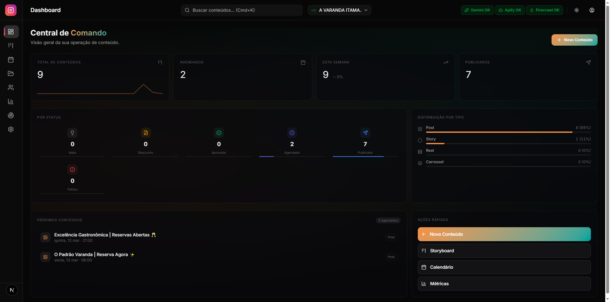
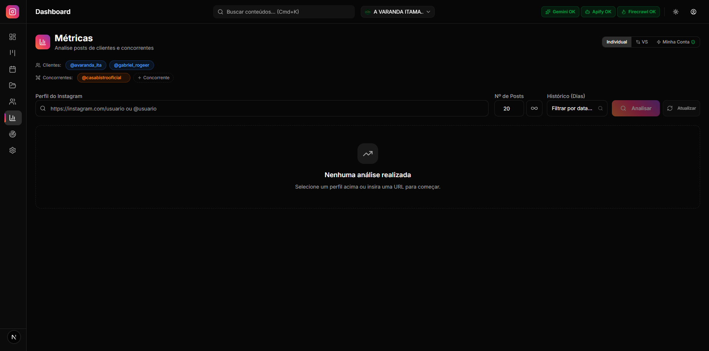
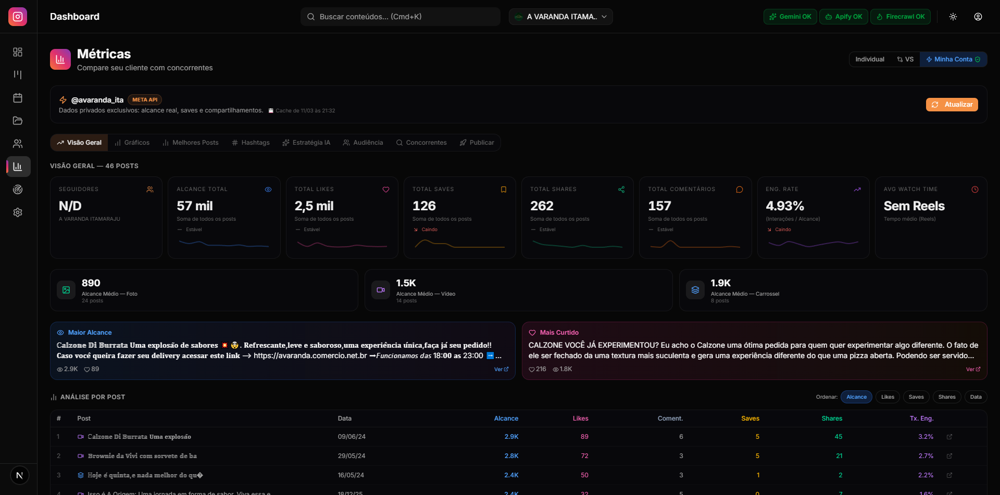
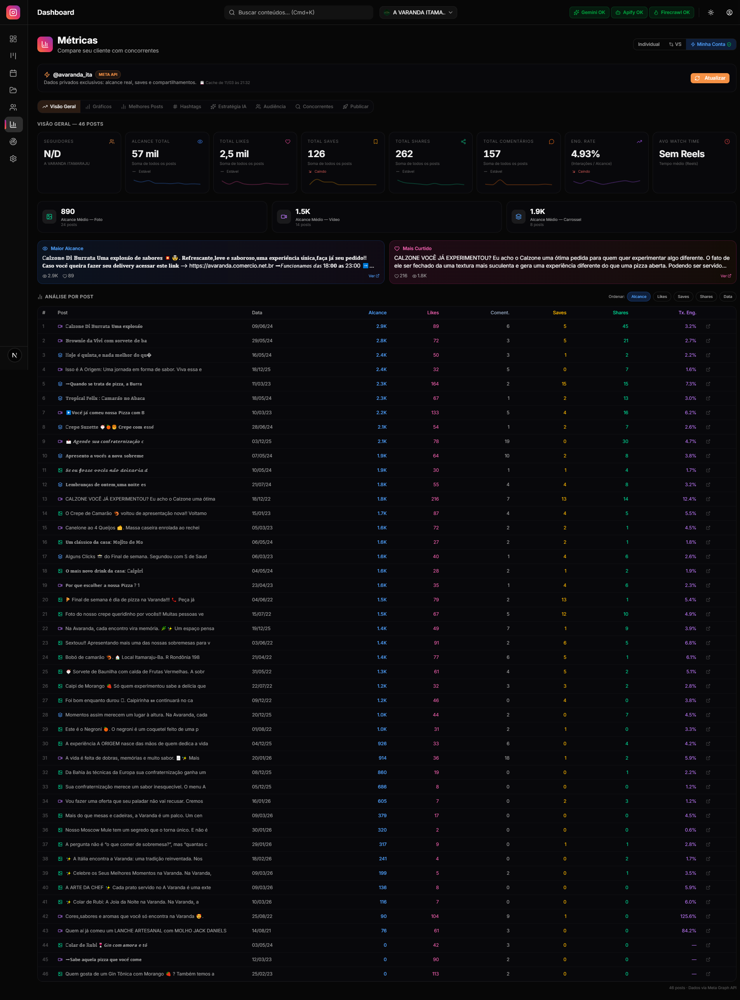
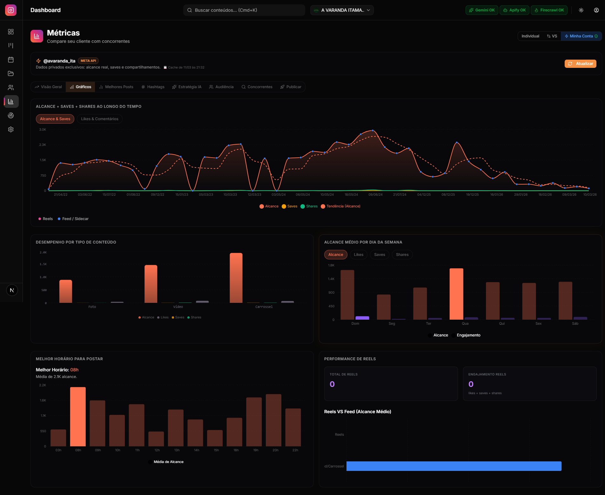
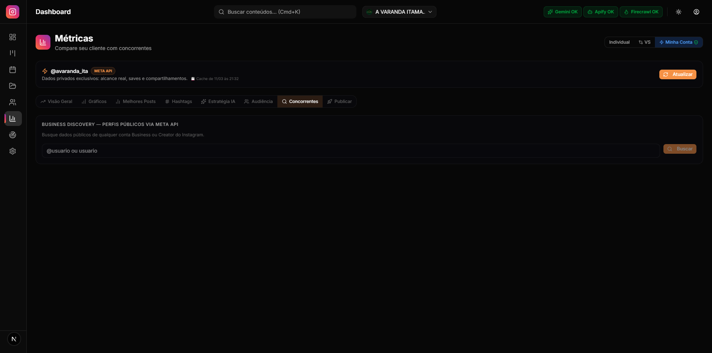

<p align="center">
  
  
  
  
  
  
  
  
  
</p>

<h1 align="center">Instagram Dashboard OSS</h1>
<h3 align="center">Content Manager &middot; Analytics Engine &middot; Ads Manager &middot; AI Intelligence &middot; Automation</h3>

<p align="center">
  Dashboard profissional completo para gerenciamento de contas Instagram.<br/>
  Gestao de conteudo, analytics com IA multimodal, gerenciamento de campanhas Meta Ads,<br/>
  automacao de publicacao e inteligencia competitiva.
</p>

<p align="center">
  <strong>Construido por Humano + IA (Claude Code / Anthropic)</strong><br/>
  <em>Todo o codigo, arquitetura, design de UI e logica de negocios foram desenvolvidos<br/>em parceria entre um humano e Claude Code (Anthropic), demonstrando o potencial<br/>da colaboracao humano-IA no desenvolvimento de software profissional.</em>
</p>

---

## Indice

1. [Sobre o Projeto](#sobre-o-projeto)
2. [Screenshots](#screenshots)
3. [Navegacao Global e Atalhos](#navegacao-global-e-atalhos)
4. [Dashboard Home](#dashboard-home)
5. [Storyboard Kanban](#storyboard-kanban)
6. [Calendario Editorial](#calendario-editorial)
7. [Editor de Conteudo](#editor-de-conteudo)
8. [Filtros Avancados](#filtros-avancados)
9. [Meta Ads Manager](#meta-ads-manager)
10. [Analytics e Metricas](#analytics-e-metricas)
11. [Motor Estatistico Avancado](#motor-estatistico-avancado)
12. [Inteligencia Artificial](#inteligencia-artificial-google-gemini)
13. [Feed Preview](#feed-preview)
14. [Contas Instagram](#contas-instagram)
15. [Colecoes e Campanhas](#colecoes-e-campanhas)
16. [Intelligence Hub](#intelligence-hub)
17. [Configuracoes](#configuracoes)
18. [Automacao e Publicacao](#automacao-e-publicacao)
19. [Arquitetura Tecnica](#arquitetura-tecnica)
20. [Banco de Dados](#banco-de-dados)
21. [Estrutura de Pastas](#estrutura-de-pastas)
22. [Instalacao](#instalacao)
23. [Seguranca](#seguranca)
24. [Creditos](#creditos)
25. [Licenca](#licenca)

---

## Sobre o Projeto

O **Instagram Dashboard OSS** e uma plataforma completa para gerenciamento profissional de contas Instagram. Combina gestao de conteudo, analytics avancados, gerenciamento de campanhas Meta Ads, inteligencia artificial multimodal (Google Gemini) e automacao de publicacao em uma interface moderna com design glassmorphism.

### Destaques

- **Meta Ads Manager**: Painel completo de campanhas com KPIs, graficos, criativos visuais e IA de otimizacao
- **Galeria de Criativos**: Visualize todos os criativos dos anuncios com metricas por ad (Gasto, CTR, CPC)
- **Analytics em 3 camadas**: Apify (scraping publico), Meta Graph API (dados privados), IA (insights estrategicos)
- **IA Multimodal**: Google Gemini analisa visualmente o grid do feed, sugere ordem de publicacao e gera estrategias
- **Automacao completa**: Publicacao automatizada via Meta API ou Playwright (browser automation)
- **Inteligencia competitiva**: Compare seu perfil com concorrentes lado a lado
- **Feed Preview**: Visualize como seu feed ficara no celular antes de publicar
- **Kanban Storyboard**: Gerencie o ciclo de vida do conteudo (Ideia -> Publicado) — agora com tipo "Campanha"
- **Agendamento inteligente**: IA sugere dias e horarios otimos para publicacao
- **Dark mode premium**: Design glassmorphism com tema escuro profissional

---

## Screenshots

### Central de Comando (Dashboard Home)

<p align="center">
  
</p>

> KPIs em tempo real: total de conteudos, agendados, publicados, distribuicao por status e tipo (incluindo Campanha), proximos conteudos e acoes rapidas.

---

### Analytics — Busca de Perfil (Apify)

<p align="center">
  
</p>

> Analise qualquer perfil publico do Instagram. Insira a URL ou @handle, configure numero de posts e periodo, e clique "Analisar". Clientes em azul, concorrentes em laranja.

---

### Analytics — Minha Conta: Visao Geral (Meta API)

<p align="center">
  
</p>

> Dados **privados exclusivos** via Meta Graph API: alcance real, saves, compartilhamentos. KPIs com sparklines, top posts em destaque, tabela completa com metricas detalhadas.

---

### Analytics — Minha Conta: Metricas Completas

<p align="center">
  
</p>

> Visao completa com todos os posts carregados: likes, comentarios, alcance, impressoes, taxa de engajamento, e tabela com colunas ordenaveis (Reach, Saves, Shares, Likes, Comments).

---

### Analytics — Graficos e Tendencias

<p align="center">
  
</p>

> Timeline de Alcance (AreaChart), Desempenho por Tipo (BarChart), Melhor Dia da Semana, Melhor Horario, e Performance de Reels vs Feed.

---

### Analytics — Business Discovery (Concorrentes)

<p align="center">
  
</p>

> Busque dados publicos de qualquer conta Business ou Creator do Instagram diretamente pela API oficial do Meta — sem scraping, dados confiaveis.

---

## Navegacao Global e Atalhos

### Sidebar (Menu Lateral)
- **9 links de navegacao**: Dashboard, Storyboard, Calendario, Ads, Colecoes, Contas, Metricas, Intelligence Hub, Configuracoes
- Logo animada do Instagram no topo com gradiente real da marca
- **Colapsavel**: Modo mini (apenas icones, 72px) ou expandido (240px) com animacao suave
- **Indicador de aba ativa**: Barra vertical com gradiente Instagram animada com spring physics
- **Mobile**: Drawer lateral acessivel via botao hamburger

### Header (Cabecalho Superior)
- Titulo dinamico da pagina
- Barra de pesquisa global
- Filtro de conta (dropdown rapido)
- Indicadores de status de API (Gemini OK, Apify OK, Firecrawl OK)
- Theme Toggle (Dark/Light)

### Command Palette (`Ctrl+K` / `Cmd+K`)
Abre de qualquer tela com 4 secoes:
- **Acoes Rapidas**: Novo Conteudo, Nova Colecao, Nova Conta
- **Navegacao**: Ir direto para qualquer pagina
- **Conteudos Recentes**: Ultimos 5 criados com link direto
- **Preferencias**: Alternar tema sem sair do teclado

---

## Dashboard Home

Pagina de boas-vindas e visao geral da operacao:

- **4 Cards KPI** (animados): Total de Conteudos, Agendados, Esta Semana, Publicados
- **Grid por Status**: 6 mini-cards (Ideia, Rascunho, Aprovado, Agendado, Publicado, Falhou)
- **Distribuicao por Tipo**: Post, Story, Reel, Carrossel, Campanha com barras percentuais
- **Proximos Conteudos**: Lista dos 5 proximos posts com titulo, data e badge de tipo
- **Acoes Rapidas**: Novo Conteudo, Storyboard, Calendario, Metricas

---

## Storyboard Kanban

Board de planejamento criativo com drag-and-drop (`@dnd-kit`):

| Coluna | Cor | Descricao |
|--------|-----|-----------|
| **Ideia** | Cinza | Brainstorm inicial |
| **Rascunho** | Amarelo | Copy sendo trabalhada |
| **Aprovado** | Verde | Aprovado pelo diretor de arte |
| **Agendado** | Roxo | Data/hora definida |
| **Publicado** | Azul | Ja foi ao ar |
| **Falhou** | Vermelho | Erro na publicacao automatica |

### Tipos de Conteudo

| Tipo | Icone | Cor | Descricao |
|------|-------|-----|-----------|
| **Post** | Image | Azul | Publicacao no feed |
| **Story** | Circle | Roxo | Story de 24h |
| **Reel** | Film | Rosa | Video curto |
| **Carrossel** | Layers | Laranja | Multiplas imagens |
| **Campanha** | Megaphone | Verde | Criativo de campanha de ads |

- Drag-and-drop livre entre colunas (status atualiza automaticamente)
- Botao `+` no topo de cada coluna (abre editor com status pre-selecionado)
- Cards com titulo, legenda, tipo, data e hashtags
- **Filtro por tipo**: Diferencia conteudos organicos de criativos de campanha

---

## Calendario Editorial

3 visualizacoes acessiveis por abas:

- **Mes**: Grid classico de 30 dias com badges de densidade
- **Semana**: 7 colunas (Seg-Dom) com cards empilhados + botao "+ Adicionar"
- **Dia**: Feed vertical detalhado do dia selecionado

Cards com cores por tipo (incluindo verde para Campanha) e badges de status.

---

## Editor de Conteudo

Drawer lateral com **2 abas** (Editar + Preview):

### Aba Editar
- Titulo, Descricao/Legenda, Tipo (Post / Story / Reel / Carrossel / Campanha)
- Status (6 opcoes do workflow)
- Conta Instagram, Data/Hora de agendamento
- Hashtags interativas com chips visuais (`TagInput`)
- Colecoes (multi-select)
- Upload de midia (JPEG, PNG, WebP, GIF, MP4, MOV)

### Aba Preview
- Mockup visual pixel-perfect do Instagram
- Header de perfil, area de imagem 4:5, barra de acoes
- Legenda compilada com contador de caracteres (`X / 2200`)

### Acoes
- **Salvar**, **Duplicar**, **Excluir**, **Publicar via Meta API** ou **Publicar via Bot**

---

## Filtros Avancados

Drawer lateral com 6 eixos de filtragem em tempo real:

1. **Tipos de Conteudo** — Post, Story, Reel, Carrossel, Campanha
2. **Status do Funil** — Ideia a Falhou
3. **Conta Instagram**
4. **Colecao / Campanha**
5. **Periodo de Agendamento** — range de datas
6. **Hashtag Especifica**

---

## Meta Ads Manager

Painel completo para gerenciamento de campanhas Meta Ads (Facebook/Instagram) integrado via **Meta Graph API v25.0**.

### Como Acessar

1. Va em **Contas** e cadastre seu **Token Facebook Ads** + **Ad Account ID**
2. Acesse a aba **Ads** na sidebar
3. Os dados carregam automaticamente

### Filtros Disponíveis

- **Periodo**: Hoje, Ontem, 7d, 14d, 30d, 90d, Este Mes, Mes Passado, Personalizado
- **Status**: Todas, Ativas, Pausadas, Arquivadas
- **Campanha especifica**: Dropdown com todas as campanhas

### 4 Sub-abas

#### 1. Campanhas (Tabela)
- Lista de todas as campanhas com metricas agregadas
- **Toggle de status**: Ative/Pause campanhas direto pela interface
- Expanda para ver AdSets de cada campanha
- Metricas: Gasto, Impressoes, Cliques, CTR, CPC, Alcance

#### 2. Criativos (Galeria Visual)
Esta e a nova aba de **Storyboard de Campanhas**:

- **Grid visual**: Thumbnails dos criativos em grade responsiva (2-5 colunas)
- **View lista**: Visualizacao compacta com metricas lado a lado
- **Metricas por criativo**: Gasto, Impressoes, Cliques, CTR, CPC individuais
- **Status badge**: Ativo, Pausado, Campanha Pausada, Reprovado, Em Analise
- **Busca**: Pesquise por nome, titulo ou texto do criativo
- **Filtro por status**: Todos, Ativos, Pausados, Campanha Pausada
- **Ordenacao**: Maior gasto, Mais impressoes, Maior CTR, Maior CPC, Nome A-Z
- **Toggle Grid/Lista**: Alterne entre visualizacoes
- **Link externo**: Hover no criativo mostra link de destino do anuncio
- **Image proxy**: Imagens via proxy para evitar CORS

> Os criativos sao carregados sob demanda ao clicar na aba — clique "Carregar Criativos" na primeira vez.

#### 3. Graficos
- Timeline de gastos diarios (AreaChart)
- Impressoes e cliques por dia
- Comparacao de performance entre campanhas

#### 4. Inteligencia (IA + Estatistica Avancada)
- Analise automatica dos dados de campanha via Gemini
- Recomendacoes de otimizacao de budget
- Insights de performance por campanha
- **Fadiga Criativa**: Score por anuncio com deteccao de esgotamento (exponential decay)
- **Saturacao de Audiencia**: Indice de frequencia vs benchmark por vertical
- **Saude da Conta**: Score 0-100 com CTR, CPC, frequencia e diversidade
- **A/B Testing**: Deteccao automatica de testes com significancia estatistica (Z-test)
- **Benchmark Comparativo**: Performance vs benchmarks da industria (Food & Beverage)

### Infraestrutura Tecnica de Ads

| Feature | Implementacao |
|---------|---------------|
| **API** | Meta Graph API v25.0 |
| **Cache** | 5 minutos TTL em memoria |
| **Circuit Breaker** | Protecao contra rate limiting (5 falhas = pausa 60s) |
| **Paginacao** | Automatica para contas com muitas campanhas |
| **Rate Limiting** | 200ms delay entre paginas |

---

## Analytics e Metricas

A tela mais complexa do sistema. Possui **3 abas** no topo:

### Aba "Individual" — Analise via Apify (Perfis Publicos)

- **Pills de Clientes** (azuis) e **Concorrentes** (laranjas)
- Busca por URL ou @handle
- Filtros de periodo: Todo, 7d, 30d, 60d, 90d, Personalizado
- **KPI Cards**: Total Posts, Likes, Comentarios, Views, Engajamento, Melhor Post
- **Insights IA**: Relatorio gerado pelo Gemini
- **Top Engajadores**: Ranking dos 10 que mais comentaram
- **Analise de Comentarios**: Sentimento + sugestoes de resposta (detalhes abaixo)
- **Cards de Post**: Grid com thumbnail, metricas e tipo

#### Modulo de Comentarios

| Botao | Fonte | Funcao |
|-------|-------|--------|
| **Apify (N posts)** | Web scraping | Todos os comentarios de N posts |
| **Meta (so novos)** | Graph API | Incremental, apenas novos desde ultimo fetch |

- **Merge aditivo**: Ambas as fontes se somam
- **Filtros**: Sentimento, periodo, ordenacao
- **IA de Opiniao**: Analise curta (max 15 palavras) por comentario
- **Sugestao de Resposta**: Texto gerado usando dados reais do negocio (endereco, telefone, horario)
- **Auto-resposta**: Envio em lote via Playwright

---

### Aba "VS" — Comparacao de Concorrentes

- Tabelas comparativas: medias por post, engajamento por tipo, frequencia
- Graficos de barras animados
- **Chatbot IA**: Converse com Gemini sobre os dados comparativos

---

### Aba "Minha Conta" — Meta Graph API

Dados **privados e precisos** (alcance real, saves, shares). Cache automatico com badge de status.

#### 8 Sub-abas:

**1. Visao Geral**
- 6 KPIs: Alcance, Curtidas, Saves, Shares, Engajamento, Comentarios
- Breakdown por tipo (Foto/Video/Carrossel)

**2. Graficos** (Recharts)
- Timeline de Alcance (AreaChart)
- Comparacao por Tipo (BarChart)
- Melhor Dia da Semana
- Melhor Horario para Postar
- Performance de Reels vs Feed

**3. Melhores Posts**
- Top 5 por: Alcance, Saves, Shares, Curtidas
- Bottom 3 para aprender o que evitar

**4. Hashtags**
- Efetividade computada localmente (sem API extra)
- Badges: Alta (top 25%), Media, Baixa
- Insight: "Hashtag #X tem Nx mais alcance que a media"

**5. Estrategia IA**
- Relatorio estrategico completo via Gemini
- 5 secoes: Formato, Dia/Horario, Hashtags, Atencao, Acoes para 4 semanas

**6. Audiencia**
- Demografia: cidade, faixa etaria, genero
- Crescimento de seguidores

**7. Concorrentes (Business Discovery)**
- Busca de dados publicos de contas Business/Creator via API oficial

**8. Feed Preview** (ver secao abaixo)

---

## Motor Estatistico Avancado

O dashboard possui um motor de analytics proprio, implementado em TypeScript puro (zero dependencias externas), com funcoes de nivel academico para analise de dados de marketing digital.

### Modulos

#### `statistics.ts` — 34 funcoes exportadas

Motor principal com estatisticas descritivas, correlacao, tendencia, deteccao de outliers, analise temporal e mais:

| Funcao | Descricao |
|--------|-----------|
| `descriptiveStats` | Media, mediana, desvio padrao amostral (Bessel), quartis, IQR, CV |
| `linearTrend` | Regressao linear com slope, R-squared e predicao |
| `pearsonCorrelation` | Correlacao entre duas variaveis |
| `engagementScore` | Score ponderado de engajamento |
| `detectOutliers` | Deteccao de outliers via IQR |
| `bestTimeToPost` | Melhor dia/hora baseado em historico |
| `movingAverage` | Media movel com janela configuravel |
| `zScores` | Z-scores para identificar performance anomala |
| `paretoAnalysis` | Analise 80/20 de conteudo |
| `shannonEntropy` | **Entropia de Shannon** para diversidade de mix de conteudo (0 = homogeneo, 1 = maximo diverso) |
| `contentVelocityScore` | Velocidade de engajamento pos-publicacao |
| `variableRewardScore` | Imprevisibilidade de conteudo (reward variavel) |
| + 22 outras | Consistencia de postagem, identidade de conteudo, comparacao temporal, etc. |

#### `math-core.ts` — Primitivas matematicas reutilizaveis

| Funcao | Descricao |
|--------|-----------|
| `normalCDF(z)` | CDF da normal padrao (Abramowitz & Stegun, erro < 7.5e-8) |
| `bootstrapCI(values, options)` | Intervalo de confianca via bootstrap (percentile method, B=1000) |
| `olsSimple(x, y)` | Regressao linear OLS com alpha, beta, R-squared e residuos |

#### `forecasting.ts` — Previsao de series temporais

| Funcao | Descricao |
|--------|-----------|
| `holtWinters(data, options)` | Triple Exponential Smoothing (aditivo) com tendencia + sazonalidade semanal. Ideal para prever metricas de engajamento nos proximos 7 dias. |
| `cusumDetect(data, options)` | Deteccao de change-points via CUSUM. Identifica quando uma metrica mudou de regime (ex: alcance caiu significativamente apos mudanca de algoritmo). |

#### `advanced-indicators.ts` — Indicadores avancados de marketing

| Funcao | O que responde | Metodo |
|--------|----------------|--------|
| `advertisingElasticity(spend, revenue)` | "Cada R$1 a mais em ads gera quanto a mais de resultado?" | Regressao log-log (elasticidade economica) |
| `creativeHalfLife(dailyCTRs)` | "Em quantos dias meu criativo perde metade da eficacia?" | Decaimento exponencial (meia-vida) |
| `diminishingReturns(spend, result)` | "Estou na zona de saturacao ou ainda posso escalar?" | Curva de Michaelis-Menten (retornos decrescentes) |

### Inteligencia de Ads (Intelligence Panel v2)

O painel de inteligencia de ads calcula automaticamente:

| Metrica | Descricao | Como interpreta |
|---------|-----------|-----------------|
| **Creative Fatigue Score** | Detecta esgotamento de criativos por CTR declinante | Verde (Fresh) / Amarelo (Aging) / Vermelho (Fatigued) |
| **Audience Saturation Index** | Frequencia vs frequencia otima por vertical | Baixo / Medio / Alto / Critico |
| **Account Health Score** | Score 0-100 combinando CTR, CPC, frequencia, diversidade | Excelente / Bom / Precisa Atencao / Critico |
| **A/B Test Detection** | Identifica testes automaticamente por nome de campanha | Significancia estatistica via Z-test |
| **Benchmark Comparison** | Compara metricas vs benchmark da industria | Acima / Na media / Abaixo |

---

## Inteligencia Artificial (Google Gemini)

O dashboard integra o Google Gemini como motor de IA multimodal:

| Funcionalidade | Descricao |
|----------------|-----------|
| **Analise Visual do Feed** | IA recebe imagem composta do grid (via Sharp), pontua harmonia visual, consistencia de marca, diversidade e apelo visual (0-10) |
| **Paleta de Cores** | Detecta cores predominantes e sugere paleta otimizada |
| **Posts Problematicos** | Identifica posts que quebram a harmonia visual (max 4, respeita pinned) |
| **Bio Sugerida** | Gera bio otimizada com emojis e CTA |
| **Destaques Sugeridos** | Sugere categorias de Highlights |
| **Recomendacoes** | Lista de acoes especificas e acionaveis |
| **IA Organizar Feed** | Reorganiza ordem de publicacao para coesao visual por linha do grid (3 colunas) |
| **Agendamento Inteligente** | Sugere datas/horarios otimos: 11:30, 18:00, 20:00 — distribuidos ao longo dos dias |
| **Estrategia Completa** | Relatorio com insights demograficos, melhores formatos, horarios e acoes |
| **Sentimento de Comentarios** | Analise automatica com sugestoes de resposta usando dados reais do negocio |
| **Intencao de Compra** | Detecta comentarios com intencao comercial |
| **Comparacao VS** | Chatbot para explorar diferencas entre perfis |
| **Analise de Ads** | Recomendacoes de otimizacao para campanhas Meta Ads |

---

## Feed Preview

Funcionalidade avancada para visualizar o feed antes de publicar:

- **Phone Mockup**: Simula celular mostrando grid com posts agendados + existentes
- **Posts Fixados**: Suporte a pinned posts no topo
- **Criativos Agendados**: Insere agendados no preview para ver resultado
- **Drag-and-Drop**: Reordene a sequencia de publicacao
- **Highlights Reais**: Exibe destaques do perfil via scraping
- **IA Organizar**: Otimiza ordem para harmonia visual por linha do grid
- **Datas Sugeridas**: IA sugere calendario de publicacao otimo
- **Salvar Ordem + Datas**: Persiste nova ordem e datas no banco

---

## Contas Instagram

Gerencie multiplos perfis/clientes:

### Card de Conta
Avatar, nome, handle, tipo de negocio, endereco, telefone e horario

### Formulario
**Dados basicos**: Nome, Handle, Avatar, Senha

**Tokens de API**:

| Campo | Descricao |
|-------|-----------|
| Token Meta Graph API | Para dados privados (alcance, saves, shares) |
| Token Facebook Ads | Para gerenciamento de campanhas de anuncios |
| Ad Account ID | ID da conta de anuncios (formato: act_XXXXXXXXX) |

**Informacoes do Negocio** (usadas pela IA para responder comentarios):

| Campo | Descricao | Exemplo |
|-------|-----------|---------|
| Tipo de negocio | Categoria | Restaurante, Clinica... |
| Endereco | Endereco fisico | Rua das Flores, 123 |
| Telefone/WhatsApp | Contato principal | (11) 99999-9999 |
| Horario | Funcionamento | Seg-Sex 12h-22h |
| Site/Cardapio | URL | https://cardapio.empresa.com |
| Observacoes | Info extra | Pet-friendly, aceita reservas |

> **Como a IA usa**: Ao gerar respostas para comentarios ("qual o endereco?"), usa SOMENTE dados reais cadastrados — nunca placeholders.

**Automacao Playwright**: Badge de status (Conectado/Aguardando Login) + botao para abrir sessao

---

## Colecoes e Campanhas

Agrupamentos tematicos com:
- Nome, icone, cor hexadecimal customizada, descricao
- Datas de inicio e fim opcionais (campanhas com prazo)
- Pagina individual com posts filtrados da colecao

---

## Intelligence Hub

Central de pesquisa com **3 abas**:

### Extrator de Maps
- Scraping completo de negocios no Google Maps via Playwright
- Dados: nome, rating, reviews, endereco, telefone, horarios, highlights
- Analise IA de sentimento das reviews

### VS Maps
- Comparacao lado a lado de 2 negocios do Google Maps

### Web Scraper (FireCrawl)
- Converte qualquer URL em Markdown estruturado

---

## Configuracoes

5 secoes organizadas:

1. **Aparencia**: Dark/Light mode
2. **Preferencias**: Visualizacao padrao do calendario
3. **Automacao**: Status de conexao de cada conta + login Playwright
4. **Integracoes (API Keys)**: Gemini, Apify, Meta, FireCrawl — salvas no banco local
5. **Dados**: Exportar/Importar backup JSON + Reset completo

---

## Automacao e Publicacao

| Canal | Metodo | Descricao |
|-------|--------|-----------|
| **Meta API** | Automatico | Publica imagens, videos, carrosseis, stories pela API oficial |
| **Playwright** | Semi-automatico | Automacao de browser quando API nao disponivel |
| **Fila** | Background | Queue com retry automatico para publicacoes agendadas |
| **Comentarios** | Batch | Respostas IA enviadas em lote via automacao |
| **Sessao** | Persistente | Playwright salva sessao para evitar login repetido |

---

## Arquitetura Tecnica

### Stack

| Camada | Tecnologias |
|--------|-------------|
| **Frontend** | Next.js 16, React 19, TypeScript 5, Tailwind CSS 4 |
| **UI** | Shadcn/UI, Framer Motion, Recharts, Lucide Icons |
| **State** | Zustand 5 (stores tipados) |
| **Backend** | Next.js API Routes + Server Actions |
| **Database** | SQLite via Prisma 5 ORM |
| **IA** | Google Gemini (multimodal — texto + imagem) |
| **APIs** | Meta Graph API v25.0, Meta Ads API, Apify, FireCrawl |
| **Automacao** | Playwright (browser automation) |
| **Imagem** | Sharp (composicao, resize, thumbnails) |

### API Routes (36)

| Rota | Funcao |
|------|--------|
| `POST /api/ads-campaigns` | Campanhas + AdSets + insights por campanha |
| `POST /api/ads-insights` | KPIs agregados + insights diarios para graficos |
| `POST /api/ads-creatives` | Ads com criativos (imagens) + insights por ad |
| `POST /api/ads-actions` | Toggle status de campanha (Ativa/Pausada) |
| `POST /api/ads-ai-analysis` | Analise IA de performance de campanhas |
| `POST /api/ads-intelligence` | Metricas de inteligencia (fadiga, saturacao, saude, A/B tests) |
| `POST /api/ads-creative-score` | Score de qualidade de criativos |
| `POST /api/meta-insights` | Metricas privadas da conta (token refresh + circuit breaker) |
| `POST /api/meta-publish` | Publicacao via Meta API |
| `POST /api/meta-discovery` | Business Discovery de concorrentes |
| `POST /api/meta-comments` | Comentarios recentes |
| `POST /api/meta-ai-strategy` | Estrategia IA com Gemini |
| `POST /api/meta-account-insights` | Metricas detalhadas da conta |
| `POST /api/meta-online-followers` | Seguidores online |
| `POST /api/meta-carousel-children` | Slides de carrossel |
| `POST /api/meta-tagged-media` | Midias taggeadas |
| `POST /api/apify` | Start scraper Apify |
| `POST /api/apify/status` | Status do actor run |
| `POST /api/apify/ai-analysis` | Insights IA dos posts scraped |
| `POST /api/apify/ai-comparison` | Comparacao IA entre perfis |
| `POST /api/feed-visual-analysis` | Analise visual multimodal do grid |
| `POST /api/feed-ai-reorder` | Reordenacao IA + agendamento inteligente |
| `POST /api/ai-comment-analysis` | Sentimento + respostas IA |
| `POST /api/maps-scrape` | Scraping Google Maps |
| `POST /api/maps-analysis` | Analise IA de reviews |
| `POST /api/firecrawl` | Web scraping |
| `POST /api/image-proxy` | Proxy de imagens externas |
| `POST /api/upload` | Upload de midia |
| `POST /api/import-md` | Importacao de conteudo via Markdown |
| `POST /api/ai-import` | Importacao inteligente via IA |
| `GET /api/instagram-highlights` | Highlights do perfil |
| `POST /api/automation/auth` | Autenticacao de automacao Playwright |
| `POST /api/automation/respond-comments` | Resposta automatica a comentarios |
| `POST /api/auth/instagram` | OAuth Instagram |
| `GET /api/auth/instagram/callback` | Callback OAuth |

### Server Actions (9)

| Action | Funcao |
|--------|--------|
| `content.actions.ts` | CRUD de conteudo + reordenacao + reagendamento |
| `account.actions.ts` | CRUD de contas + login + publicacao |
| `analytics.actions.ts` | Cache de metricas (Apify + Meta) |
| `instagram.actions.ts` | Automacao e publicacao |
| `collection.actions.ts` | CRUD de colecoes |
| `competitor.actions.ts` | CRUD de concorrentes |
| `settings.actions.ts` | Persistencia de configuracoes |
| `maps.actions.ts` | Operacoes Google Maps |
| `api-status.actions.ts` | Status das integracoes |

---

## Banco de Dados

SQLite local via Prisma ORM. **7 modelos:**

| Modelo | Descricao |
|--------|-----------|
| **Account** | Contas Instagram + info de negocio + tokens Ads (endereco, telefone, horarios como JSON) |
| **Content** | Posts, Stories, Reels, Carrosseis, Campanhas com workflow de 6 status |
| **Collection** | Campanhas/temas com cor, icone e periodo |
| **Competitor** | Perfis concorrentes salvos com metricas |
| **Analytics** | Cache de metricas (Apify + Meta) em JSON. `type='meta'` = dados privados |
| **Setting** | Configuracoes key-value (API keys, preferencias) |
| **MapsBusiness** | Dados Google Maps (reviews, analise IA) |

---

## Estrutura de Pastas

```
instagram-dashboard/
├── app/
│   ├── dashboard/                # Paginas do dashboard
│   │   ├── page.tsx              # Home (Central de Comando)
│   │   ├── storyboard/           # Kanban Board
│   │   ├── calendar/             # Calendario
│   │   ├── ads/                  # Meta Ads Manager (4 tabs)
│   │   ├── analytics/            # Analytics (3 abas)
│   │   ├── accounts/             # Gestao de contas
│   │   ├── collections/          # Colecoes/Campanhas
│   │   ├── intelligence/         # Hub de Inteligencia
│   │   └── settings/             # Configuracoes
│   ├── api/                      # 36 API Routes
│   └── actions/                  # 9 Server Actions
├── features/                     # Modulos de funcionalidade
│   ├── ads/components/           # Ads: tabela, graficos, criativos, inteligencia v2
│   ├── analytics/components/     # 30+ componentes de analytics
│   ├── content/components/       # Editor + TagInput
│   ├── storyboard/components/    # Board + Cards draggable
│   ├── calendar/components/      # Month/Week/Day views
│   ├── collections/components/   # List + Form
│   └── accounts/components/      # List + Form com business info
├── lib/
│   ├── services/                   # Servicos de backend
│   │   ├── facebook-ads.service.ts   # Meta Ads API v25.0 (campaigns, insights, creatives, intelligence)
│   │   ├── instagram-graph.service.ts  # Meta Graph API completa
│   │   ├── instagram.service.ts        # Playwright automation
│   │   ├── apify.service.ts            # Scraping Apify
│   │   ├── ai-adapter.ts              # Gemini/OpenRouter adapter
│   │   ├── maps-playwright.service.ts  # Google Maps scraper
│   │   └── scheduler.service.ts        # Fila de publicacao
│   └── utils/                      # Motor estatistico (pure TypeScript)
│       ├── statistics.ts             # 34 funcoes: descritivas, tendencia, outliers, Shannon entropy
│       ├── math-core.ts              # Primitivas: normalCDF, bootstrap CI, OLS regression
│       ├── forecasting.ts            # Holt-Winters, CUSUM change-point detection
│       ├── advanced-indicators.ts    # Elasticidade, meia-vida criativa, retornos decrescentes
│       └── sentiment.ts              # Analise de sentimento em portugues
├── stores/                       # Zustand (9 slices: account, ads, analytics, automation, calendar, collection, content, settings, ui)
├── components/                   # UI (Shadcn/UI) + Layout + Shared
├── hooks/                        # Custom hooks
├── types/                        # TypeScript interfaces
├── prisma/schema.prisma          # Schema SQLite
├── scripts/                      # Scripts utilitarios (scheduler, publisher)
└── docs/                         # Screenshots + documentacao
```

---

## Instalacao

### Pre-requisitos

- **Node.js** 18+ (recomendado 20+)
- **pnpm** (ou npm/yarn)

### Setup

```bash
# 1. Clone o repositorio
git clone https://github.com/avaranda66-oss/DASHBOARINSTAGRAM.git
cd DASHBOARINSTAGRAM

# 2. Instale as dependencias
pnpm install

# 3. Copie o arquivo de ambiente
cp .env.example .env

# 4. Gere o cliente Prisma e crie o banco
npx prisma generate
npx prisma db push

# 5. (Opcional) Instale browsers do Playwright para automacao
npx playwright install chromium

# 6. Inicie o servidor de desenvolvimento
pnpm dev
```

Abra `http://localhost:3000` no navegador.

### Configuracao de APIs (via UI)

Apos iniciar, va em **Configuracoes** e configure as chaves:

| API | Onde obter | Para que serve |
|-----|-----------|----------------|
| **Google Gemini** | [Google AI Studio](https://aistudio.google.com/) | Todas as funcionalidades de IA |
| **Apify** | [apify.com](https://apify.com/) | Scraping de perfis publicos |
| **Meta Graph API** | [Meta for Developers](https://developers.facebook.com/) | Dados privados (alcance, saves, shares) |
| **FireCrawl** | [firecrawl.dev](https://firecrawl.dev/) | Web scraping |

> **Nota:** O dashboard funciona sem nenhuma API configurada. Cada funcionalidade que requer API mostrara indicadores visuais no header (Gemini OK, Apify OK, etc.).

### Meta Graph API (Dados Privados)

Para acessar dados privados da sua conta:

1. Crie um App no [Meta for Developers](https://developers.facebook.com/)
2. Adicione o produto "Instagram Graph API"
3. Conecte sua conta Instagram Business ou Creator
4. Gere um Long-Lived Token
5. Cole o token na pagina de Contas do dashboard

O dashboard gerencia refresh automatico do token e usa circuit breaker para rate limiting.

### Meta Ads API (Campanhas)

Para gerenciar campanhas de anuncios:

1. No mesmo App do Meta, adicione o produto "Marketing API"
2. Gere um token com permissoes `ads_read` e `ads_management`
3. Na pagina de **Contas**, preencha:
   - **Token Facebook Ads**: O token gerado
   - **Ad Account ID**: No formato `act_XXXXXXXXX` (encontre em Business Manager > Configuracoes)
4. Acesse a aba **Ads** para ver campanhas, criativos e metricas

---

## Seguranca

- **Nenhuma API key e armazenada em arquivos** — todas ficam no banco SQLite local
- **Banco de dados (`.db`) e gitignored** — nunca commitado
- **Sessoes Playwright** salvas localmente em `sessions/` (gitignored)
- **Nenhum dado e enviado a terceiros** exceto as APIs que voce configurou
- **Senhas de Instagram** armazenadas em plaintext no SQLite local — recomendamos usar tokens de API quando possivel
- `.gitignore` extenso cobrindo: banco, sessoes, uploads, screenshots, scripts de teste

---

## Creditos

### Desenvolvimento
- **Humano + [Claude Code](https://claude.ai/claude-code)** (Anthropic) — Todo o codigo, arquitetura e design

### Tecnologias
- [Next.js](https://nextjs.org/) — Framework React
- [Tailwind CSS](https://tailwindcss.com/) — Estilizacao
- [Prisma](https://www.prisma.io/) — ORM
- [Shadcn/UI](https://ui.shadcn.com/) — Componentes UI
- [Recharts](https://recharts.org/) — Graficos
- [Framer Motion](https://www.framer.com/motion/) — Animacoes
- [Zustand](https://zustand-demo.pmnd.rs/) — State management
- [Google Gemini](https://ai.google.dev/) — IA multimodal
- [Meta Graph API](https://developers.facebook.com/docs/instagram-api/) — Dados Instagram
- [Meta Ads API](https://developers.facebook.com/docs/marketing-apis/) — Campanhas de Anuncios
- [Apify](https://apify.com/) — Web scraping
- [Playwright](https://playwright.dev/) — Browser automation
- [Sharp](https://sharp.pixelplumbing.com/) — Processamento de imagem

---

## Licenca

Distribuido sob a licenca MIT. Veja `LICENSE` para mais informacoes.

---

<p align="center">
  <strong>Instagram Dashboard OSS</strong><br/>
  <em>Desenvolvido por Humano + IA (Claude Code / Anthropic)</em><br/>
  Next.js 16 &middot; React 19 &middot; TypeScript 5 &middot; Tailwind 4 &middot; Prisma 5 &middot; Google Gemini &middot; Meta Graph API &middot; Meta Ads API
</p>
