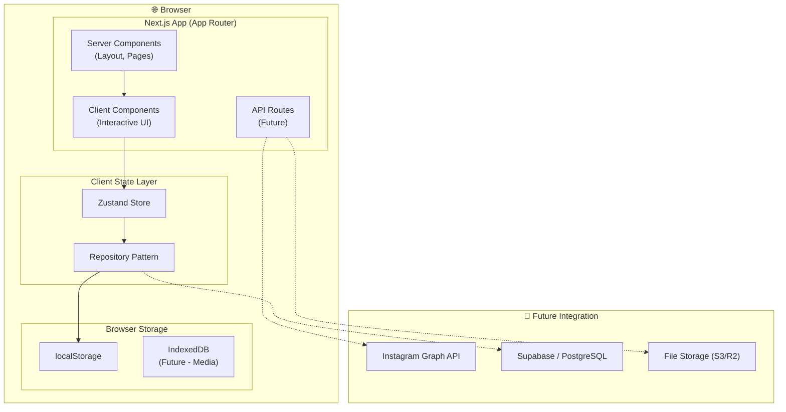
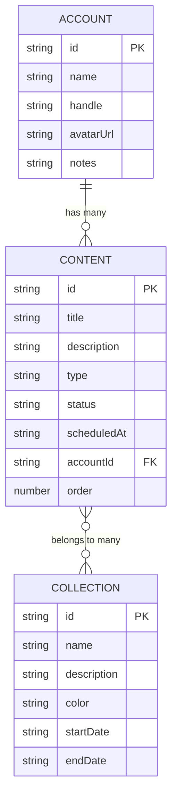
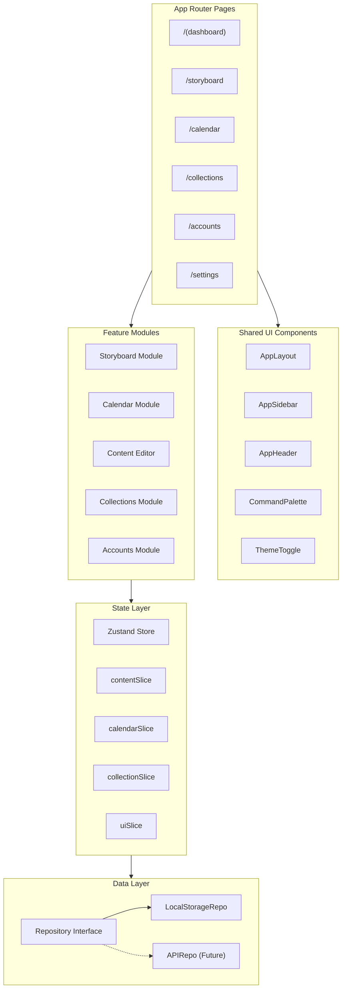
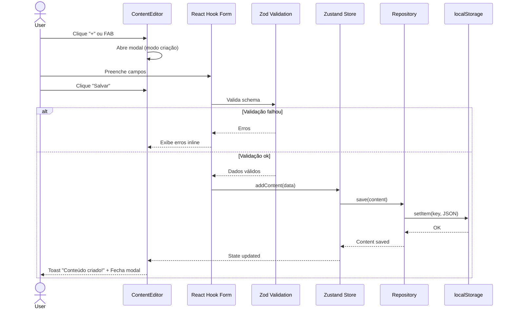
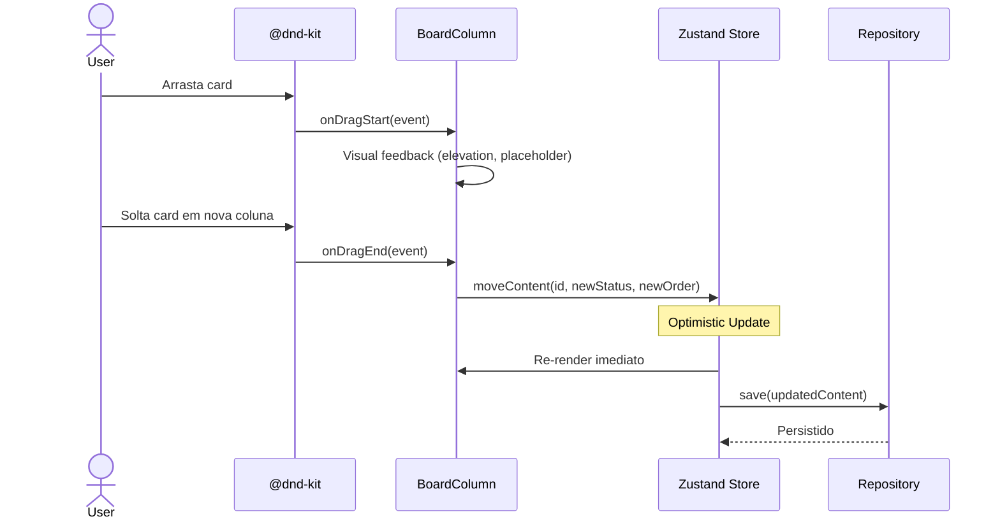

# Dashboard Instagram — Architecture Document

## 1. Introduction

Este documento descreve a arquitetura completa do **Dashboard Instagram**, um sistema de gerenciamento de conteúdo para páginas de Instagram. Serve como blueprint técnico para desenvolvimento, garantindo consistência de padrões e decisões.

**Relacionamento com o PRD:** Este documento implementa as decisões técnicas definidas no [PRD](file:///c:/Users/Usuario/Desktop/DASHBOARD%20INSTAGRAM/DASHBOARD-INSTAGRAM/docs/prd.md).

### 1.1 Starter Template

Projeto greenfield usando `create-next-app` com App Router e TypeScript como scaffolding base.

### 1.2 Change Log

| Date       | Version | Description                 | Author    |
| ---------- | ------- | --------------------------- | --------- |
| 2026-03-09 | 0.1     | Versão inicial              | Architect |

---

## 2. High-Level Architecture

### 2.1 Technical Summary

O Dashboard Instagram é uma aplicação **Next.js 15 full-stack monolítica** usando App Router com Server Components e Client Components. A camada de UI usa **Tailwind CSS v4** e **shadcn/ui** como design system. O estado é gerenciado com **Zustand** e a persistência no MVP é client-side via **localStorage** com uma camada de abstração (Repository Pattern) que permite migração transparente para um backend com banco de dados. O drag-and-drop é implementado com **@dnd-kit** e as animações com **Framer Motion**.

### 2.2 High-Level Overview

1. **Monolith Next.js** — Uma única aplicação servindo frontend (RSC + Client Components) e API Routes
2. **Monorepo** — Todo o código em um único repositório
3. **Client-First Architecture** — No MVP, toda a lógica de negócio roda no client; API Routes ficam como stubs para futura integração
4. **Data Flow:** User ↔ React Components ↔ Zustand Store ↔ Repository (localStorage) ↔ Browser Storage
5. **Decisão:** Client-side persistence no MVP para velocidade de desenvolvimento; estrutura de Repository Pattern permite trocar para API sem refatorar componentes

### 2.3 High-Level Diagram



### 2.4 Architectural and Design Patterns

- **Repository Pattern:** Abstração da camada de dados com interface `IRepository<T>` e implementação `LocalStorageRepository`. Permite trocar por `APIRepository` sem alterar stores ou componentes. — *Rationale: Preparação para migração futura sem impacto na UI*

- **Feature-Based Module Organization:** Código organizado por feature (content, calendar, collections, accounts) ao invés de tipo (components, services, utils). — *Rationale: Escalabilidade e coesão — cada feature é auto-contida*

- **Compound Components Pattern:** Componentes complexos (Board, Calendar) construídos como composição de sub-componentes. — *Rationale: Flexibilidade e reusabilidade com shadcn/ui*

- **State Management com Zustand Slices:** Store global particionado em slices (contentSlice, calendarSlice, uiSlice) combinados em um único store. — *Rationale: Separação de responsabilidades com simplicidade de API*

- **Optimistic Updates:** Atualizações visuais imediatas no drag-and-drop com rollback em caso de erro de persistência. — *Rationale: UX fluida em operações frequentes*

---

## 3. Tech Stack

### 3.1 Technology Stack Table

| Category             | Technology           | Version  | Purpose                                      | Rationale                                                  |
| -------------------- | -------------------- | -------- | -------------------------------------------- | ---------------------------------------------------------- |
| **Language**         | TypeScript           | 5.7+     | Linguagem principal                          | Type safety, DX, ecossistema                               |
| **Runtime**          | Node.js              | 22 LTS   | Runtime do servidor                          | LTS estável, compatibilidade Next.js                       |
| **Framework**        | Next.js              | 15.x     | Framework React full-stack                   | App Router, RSC, API Routes — stack obrigatório             |
| **Styling**          | Tailwind CSS         | 4.x      | Utility-first CSS                            | Stack obrigatório, performance, DX                         |
| **Components**       | shadcn/ui            | latest   | Design system base                           | Stack obrigatório, customizável, headless                  |
| **State Mgmt**       | Zustand              | 5.x      | State management client                      | Simples, performático, middleware persist                   |
| **DnD**              | @dnd-kit/core        | 6.x      | Drag-and-drop                                | Acessível, performático, tree-shakeable                    |
| **Animation**        | Framer Motion        | 12.x     | Animações e transições                       | API declarativa, gestures, layout animations               |
| **Forms**            | React Hook Form      | 7.x      | Forms manager                                | Performático, uncontrolled, TS-friendly                    |
| **Validation**       | Zod                  | 3.x      | Schema validation                            | TypeScript-first, composable, integra com RHF              |
| **Dates**            | date-fns             | 4.x      | Manipulação de datas                         | Tree-shakeable, imutable, i18n pt-BR                       |
| **IDs**              | nanoid               | 5.x      | Geração de IDs únicos                        | Pequeno, rápido, URL-safe                                  |
| **Icons**            | Lucide React         | latest   | Biblioteca de ícones                         | Integrado com shadcn/ui, SVG otimizados                    |
| **Font**             | Inter (Google Fonts) | —        | Tipografia                                   | Moderna, legível, variável                                 |
| **Linting**          | ESLint               | 9.x      | Code linting                                 | Next.js config integrado                                   |
| **Formatting**       | Prettier             | 3.x      | Code formatting                              | Consistência de estilo                                     |
| **Testing**          | Vitest               | 3.x      | Unit/component tests                         | Compatível Vite, rápido, TS nativo                         |
| **Test Utils**       | Testing Library      | 16.x     | React component testing                      | Testing best practices, semântico                          |
| **Package Manager**  | pnpm                 | 9.x      | Gerenciador de pacotes                       | Rápido, eficiente em disco, workspaces                     |
| **Deploy**           | Vercel               | —        | Hosting / Deploy                             | Integração nativa Next.js, free tier                       |

---

## 4. Data Models

### 4.1 Content (Conteúdo)

**Purpose:** Entidade central que representa um post/story/reel planejado.

**Key Attributes:**
| Attribute      | Type                                                       | Description                        |
| -------------- | ---------------------------------------------------------- | ---------------------------------- |
| `id`           | `string`                                                   | ID único (nanoid)                  |
| `title`        | `string`                                                   | Título do conteúdo                 |
| `description`  | `string \| null`                                           | Legenda / descrição                |
| `type`         | `'post' \| 'story' \| 'reel' \| 'carousel'`               | Tipo de conteúdo                   |
| `status`       | `'idea' \| 'draft' \| 'approved' \| 'scheduled' \| 'published'` | Status no pipeline           |
| `scheduledAt`  | `string \| null`                                           | Data/hora prevista (ISO 8601)      |
| `hashtags`     | `string[]`                                                 | Lista de hashtags                  |
| `mediaUrls`    | `string[]`                                                 | URLs/base64 de imagens/vídeos      |
| `accountId`    | `string \| null`                                           | Conta Instagram vinculada          |
| `collectionIds`| `string[]`                                                 | Coleções associadas                |
| `order`        | `number`                                                   | Ordem dentro da coluna             |
| `createdAt`    | `string`                                                   | Data de criação (ISO 8601)         |
| `updatedAt`    | `string`                                                   | Data de atualização (ISO 8601)     |

**Relationships:**
- Pertence a uma `Account` (N:1)
- Pertence a muitas `Collection` (N:N via array de IDs)

### 4.2 Account (Conta Instagram)

**Purpose:** Perfil Instagram gerenciado pelo usuário.

| Attribute   | Type     | Description                     |
| ----------- | -------- | ------------------------------- |
| `id`        | `string` | ID único (nanoid)               |
| `name`      | `string` | Nome da página                  |
| `handle`    | `string` | @ do Instagram                  |
| `avatarUrl` | `string \| null` | URL do avatar            |
| `notes`     | `string \| null` | Notas sobre a conta      |
| `createdAt` | `string` | Data de criação                 |

**Relationships:**
- Possui muitos `Content` (1:N)

### 4.3 Collection (Coleção / Campanha)

**Purpose:** Agrupamento temático de conteúdos.

| Attribute     | Type            | Description                  |
| ------------- | --------------- | ---------------------------- |
| `id`          | `string`        | ID único (nanoid)            |
| `name`        | `string`        | Nome da coleção              |
| `description` | `string \| null`| Descrição                    |
| `color`       | `string`        | Cor (hex)                    |
| `icon`        | `string \| null`| Ícone Lucide                 |
| `startDate`   | `string \| null`| Data início da campanha      |
| `endDate`     | `string \| null`| Data fim                     |
| `createdAt`   | `string`        | Data de criação              |

**Relationships:**
- Possui muitos `Content` (N:N via `collectionIds` no Content)

### 4.4 UserSettings (Configurações)

| Attribute          | Type                              | Description                     |
| ------------------ | --------------------------------- | ------------------------------- |
| `theme`            | `'dark' \| 'light' \| 'system'`  | Tema visual                     |
| `defaultView`      | `'board' \| 'calendar'`          | Visualização padrão             |
| `calendarView`     | `'month' \| 'week' \| 'day'`     | View padrão do calendário       |
| `sidebarCollapsed` | `boolean`                         | Estado da sidebar               |

### 4.5 Entity Relationship Diagram



---

## 5. Components

### 5.1 Layout Shell

**Responsibility:** Estrutura visual principal — sidebar de navegação e header.

**Key Interfaces:**
- `<AppSidebar />` — Navegação principal, colapsável
- `<AppHeader />` — Título da página, theme toggle, avatar, search
- `<AppLayout />` — Wrapper que combina sidebar + header + content area

**Dependencies:** shadcn/ui (Sheet, Button, DropdownMenu), Zustand (uiSlice)

### 5.2 Storyboard Module

**Responsibility:** Board Kanban com colunas de status e cards de conteúdo com drag-and-drop.

**Key Interfaces:**
- `<StoryboardPage />` — Página principal do board
- `<BoardColumn />` — Coluna de status com lista de cards
- `<ContentCard />` — Card individual representando um conteúdo
- `<DndProvider />` — Wrapper do @dnd-kit para contexto de drag-and-drop

**Dependencies:** @dnd-kit/core, Zustand (contentSlice), Content data model

### 5.3 Calendar Module

**Responsibility:** Calendário editorial com visualizações mensal, semanal e diária.

**Key Interfaces:**
- `<CalendarPage />` — Página do calendário com toggle de views
- `<MonthView />` — Grid mensal
- `<WeekView />` — Timeline semanal
- `<DayView />` — Timeline diária detalhada
- `<CalendarEvent />` — Chip de conteúdo no calendário

**Dependencies:** date-fns, Zustand (contentSlice, calendarSlice)

### 5.4 Content Editor

**Responsibility:** Modal/Sheet para criação e edição de conteúdos.

**Key Interfaces:**
- `<ContentEditorDialog />` — Modal principal do editor
- `<ContentForm />` — Formulário com todos os campos
- `<MediaUploader />` — Upload e preview de imagens
- `<TagInput />` — Input de hashtags com autocomplete

**Dependencies:** React Hook Form, Zod, shadcn/ui (Dialog, Input, Select, DatePicker)

### 5.5 Collections Module

**Responsibility:** CRUD e visualização de coleções/campanhas.

**Key Interfaces:**
- `<CollectionsPage />` — Listagem de coleções
- `<CollectionDetail />` — Detalhe com conteúdos vinculados
- `<CollectionFormDialog />` — Criação/edição de coleção

**Dependencies:** Zustand (collectionSlice)

### 5.6 Command Palette

**Responsibility:** Navegação e ações rápidas via teclado (Ctrl+K).

**Key Interfaces:**
- `<CommandPalette />` — Modal com busca fuzzy e lista de ações

**Dependencies:** shadcn/ui (Command/cmdk)

### 5.7 Component Diagram



---

## 6. Core Workflows

### 6.1 Content Creation Flow



### 6.2 Drag-and-Drop Status Update



---

## 7. Source Tree

```
dashboard-instagram/
├── app/                           # Next.js App Router
│   ├── layout.tsx                 # Root layout (providers, fonts, theme)
│   ├── page.tsx                   # Redirect → /dashboard
│   ├── globals.css                # Tailwind + CSS custom properties
│   ├── (dashboard)/               # Route group com layout shell
│   │   ├── layout.tsx             # Dashboard layout (sidebar + header)
│   │   ├── page.tsx               # Dashboard home
│   │   ├── storyboard/
│   │   │   └── page.tsx           # Storyboard Kanban
│   │   ├── calendar/
│   │   │   └── page.tsx           # Calendário Editorial
│   │   ├── collections/
│   │   │   ├── page.tsx           # Lista de coleções
│   │   │   └── [id]/
│   │   │       └── page.tsx       # Detalhe da coleção
│   │   ├── accounts/
│   │   │   └── page.tsx           # Gerenciamento de contas
│   │   └── settings/
│   │       └── page.tsx           # Configurações
│   └── api/                       # API Routes (future)
│       └── health/
│           └── route.ts           # Health check
├── components/                    # Componentes compartilhados
│   ├── ui/                        # shadcn/ui components
│   │   ├── button.tsx
│   │   ├── card.tsx
│   │   ├── dialog.tsx
│   │   ├── input.tsx
│   │   ├── select.tsx
│   │   ├── command.tsx
│   │   └── ...
│   ├── layout/                    # Layout components
│   │   ├── app-sidebar.tsx
│   │   ├── app-header.tsx
│   │   ├── app-layout.tsx
│   │   └── theme-toggle.tsx
│   └── shared/                    # Reusable feature components
│       ├── command-palette.tsx
│       ├── media-uploader.tsx
│       ├── tag-input.tsx
│       └── content-type-badge.tsx
├── features/                      # Feature modules
│   ├── storyboard/
│   │   ├── components/
│   │   │   ├── board.tsx
│   │   │   ├── board-column.tsx
│   │   │   ├── content-card.tsx
│   │   │   └── dnd-provider.tsx
│   │   └── hooks/
│   │       └── use-board-dnd.ts
│   ├── calendar/
│   │   ├── components/
│   │   │   ├── calendar-view.tsx
│   │   │   ├── month-view.tsx
│   │   │   ├── week-view.tsx
│   │   │   ├── day-view.tsx
│   │   │   └── calendar-event.tsx
│   │   └── hooks/
│   │       └── use-calendar.ts
│   ├── content/
│   │   ├── components/
│   │   │   ├── content-editor-dialog.tsx
│   │   │   └── content-form.tsx
│   │   ├── hooks/
│   │   │   └── use-content-form.ts
│   │   └── schemas/
│   │       └── content.schema.ts
│   ├── collections/
│   │   ├── components/
│   │   │   ├── collection-list.tsx
│   │   │   ├── collection-detail.tsx
│   │   │   └── collection-form-dialog.tsx
│   │   └── hooks/
│   │       └── use-collections.ts
│   └── accounts/
│       ├── components/
│       │   ├── account-list.tsx
│       │   └── account-form-dialog.tsx
│       └── hooks/
│           └── use-accounts.ts
├── stores/                        # Zustand stores
│   ├── index.ts                   # Combined store
│   ├── content-slice.ts
│   ├── collection-slice.ts
│   ├── account-slice.ts
│   └── ui-slice.ts
├── lib/                           # Utilities & infrastructure
│   ├── repository/
│   │   ├── repository.interface.ts
│   │   ├── local-storage.repository.ts
│   │   └── index.ts
│   ├── utils.ts                   # cn() helper, misc utilities
│   └── constants.ts               # App constants, statuses, types
├── types/                         # TypeScript type definitions
│   ├── content.ts
│   ├── account.ts
│   ├── collection.ts
│   └── settings.ts
├── hooks/                         # Global custom hooks
│   ├── use-theme.ts
│   ├── use-keyboard-shortcut.ts
│   └── use-media-query.ts
├── public/                        # Static assets
│   ├── favicon.ico
│   └── icons/
├── docs/                          # Project documentation
│   ├── prd.md
│   └── architecture.md
├── .eslintrc.json
├── .prettierrc
├── tailwind.config.ts
├── tsconfig.json
├── next.config.ts
├── package.json
└── README.md
```

---

## 8. Infrastructure and Deployment

### 8.1 Deployment Strategy

- **Platform:** Vercel (free tier)
- **Strategy:** Preview Deployments por branch + Production na `main`
- **CI/CD:** Vercel Git Integration (auto-deploy on push)

### 8.2 Environments

- **Development:** `localhost:3000` com `pnpm dev`
- **Preview:** Deploy automático por PR no Vercel
- **Production:** Deploy automático na merge para `main`

### 8.3 Rollback Strategy

- **Primary:** Revert via Vercel Dashboard (instant rollback to previous deployment)
- **Secondary:** `git revert` + push para `main`

---

## 9. Error Handling Strategy

### 9.1 General Approach

- **Error Model:** Error boundaries no React para erros de renderização; try-catch na camada de repositório
- **Error Propagation:** Erros de persistência logados no console e exibidos como toast notifications

### 9.2 Logging Standards

- **Library:** `console` (MVP) → migrar para serviço de logging (Sentry) em produção
- **Format:** `[MODULE] ACTION: message` (ex: `[ContentRepo] SAVE: Failed to persist content abc123`)
- **Levels:** error, warn, info (dev only), debug (dev only)

### 9.3 Error Handling Patterns

- **Storage Errors:** Catch `QuotaExceededError` em localStorage → notificar usuário para limpar dados antigos
- **Validation Errors:** Zod errors mapeados para mensagens user-friendly no formulário
- **DnD Errors:** Rollback otimista em caso de falha de persistência

---

## 10. Coding Standards

### 10.1 Core Standards

- **Language:** TypeScript 5.7+ com strict mode (`"strict": true`)
- **Linting:** ESLint com config Next.js + Prettier
- **Components:** Function components com arrow functions
- **Naming:** PascalCase para componentes, camelCase para funções/variáveis, kebab-case para arquivos

### 10.2 Naming Conventions

| Element        | Convention     | Example                          |
| -------------- | -------------- | -------------------------------- |
| Componentes    | PascalCase     | `ContentCard`, `BoardColumn`     |
| Arquivos TSX   | kebab-case     | `content-card.tsx`               |
| Hooks          | camelCase      | `useContentForm`, `useTheme`     |
| Stores         | kebab-case     | `content-slice.ts`               |
| Types/Interfaces | PascalCase   | `Content`, `Account`             |
| Constantes     | UPPER_SNAKE    | `CONTENT_STATUSES`               |

### 10.3 Critical Rules

- **No `any`:** Nunca usar `any` — usar `unknown` + type narrowing quando necessário
- **No `console.log` em produção:** Usar apenas em desenvolvimento; remover antes de PR
- **Repository Pattern:** Todo acesso a dados DEVE passar pela camada de repositório, nunca acessar localStorage diretamente nos componentes
- **Zustand only:** Não usar useState para estado compartilhado — usar Zustand store
- **shadcn/ui first:** Usar componentes shadcn/ui como base; nunca criar componentes que já existem no shadcn
- **Server vs Client:** Marcar `'use client'` apenas nos componentes que realmente precisam de interatividade

---

## 11. Test Strategy

### 11.1 Testing Philosophy

- **Approach:** Test-after no MVP, TDD para features críticas (persistência, drag-and-drop)
- **Coverage Goals:** 70% para utils e stores, 50% para componentes
- **Test Pyramid:** 60% unit, 30% component/integration, 10% E2E (future)

### 11.2 Test Types

**Unit Tests (Vitest):**
- Framework: Vitest 3.x
- Location: `__tests__/` co-located com o módulo
- Foco: Zustand stores, repository, utilities, schemas Zod

**Component Tests (Testing Library):**
- Framework: @testing-library/react
- Foco: Formulários, interações de UI, renderização condicional

**E2E (Future - Playwright):**
- Foco: Fluxo de criação de conteúdo, drag-and-drop, navegação

---

## 12. Security

### 12.1 Input Validation

- **Library:** Zod
- **Location:** Schemas em `features/*/schemas/` — validação no formulário (client) e na camada de repositório
- **Rules:** Todos os inputs de usuário validados com schemas Zod antes de persistir

### 12.2 Data Protection

- **localStorage:** Dados não criptografados no MVP (não há dados sensíveis)
- **Media:** Imagens armazenadas como object URLs (não saem do browser)
- **Future:** Ao migrar para backend, implementar autenticação (NextAuth.js) e criptografia

### 12.3 Dependency Security

- **Scanning:** `pnpm audit` no CI
- **Update Policy:** Dependências atualizadas mensalmente; patches de segurança imediatos

---

## 13. Next Steps

1. **Frontend Development:** Usar este documento + PRD com `@dev` para começar implementação do Epic 1
2. **Design System:** Configurar shadcn/ui com tema customizado antes de iniciar componentes
3. **Infrastructure:** Deploy inicial no Vercel com `@devops` após Epic 1
